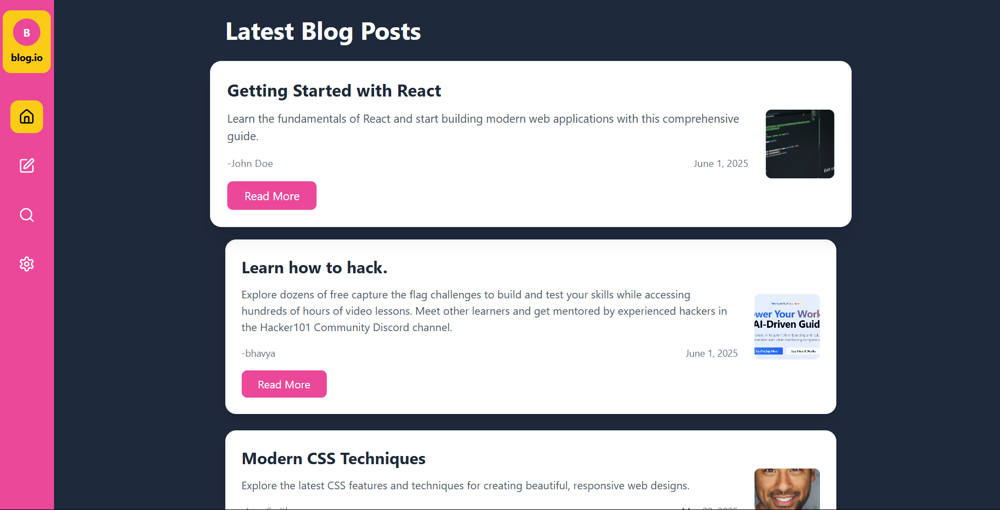
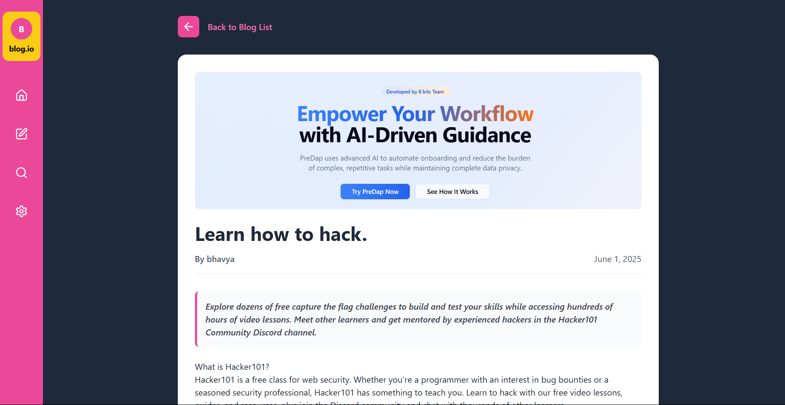
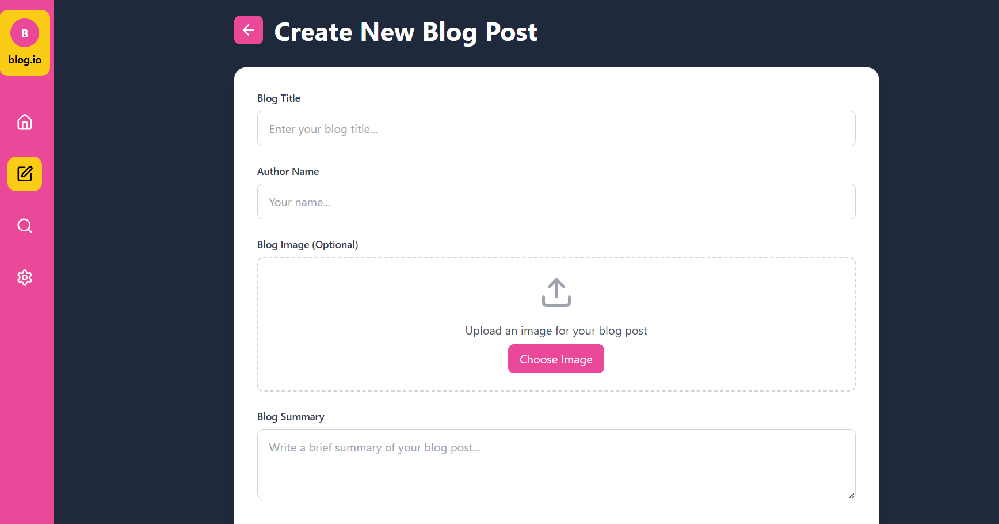
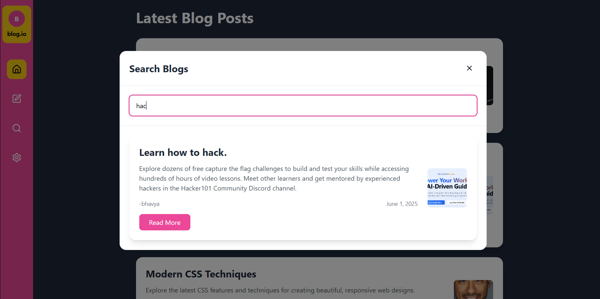

# React Project

## Project Overview

This is a React-based frontend application built using modern technologies for fast development and great user experience.

## Getting Started

Make sure you have **Node.js** and **npm** installed. If not, install them using [nvm](https://github.com/nvm-sh/nvm#installing-and-updating).

### Steps to run locally:

```sh
# 1. Clone the repository
git clone <YOUR_GIT_URL>

# 2. Navigate into the project directory
cd <YOUR_PROJECT_NAME>

# 3. Install dependencies
npm install

# 4. Start the development server
npm run dev

Tech Stack
Vite

React

TypeScript

Tailwind CSS

shadcn-ui

Deployment
You can deploy this app to platforms like Vercel, Netlify, or GitHub Pages.
Make sure to build the app using:


npm run build

Here is the deployed link on Netlify:
``` 
[Link](https://683c8e32466de339816301eb--blog-assignment-main.netlify.app)

---

Let me know if you'd like to add **project-specific features** or contribution guidelines!

UI Samples as follows:







